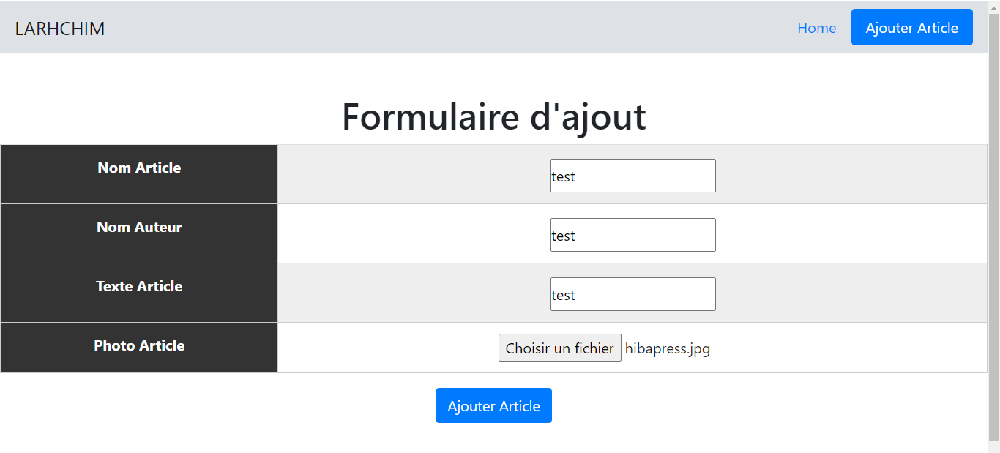
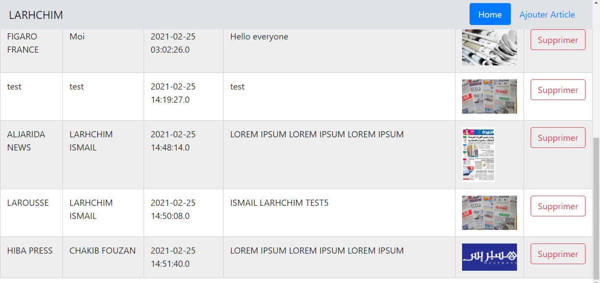

# Gestion_Publication_Journal_SPRING_BOOT_DATA
SPRING BOOT ,SPRING DATA,SPRING IOC,THYMLEAF,HTML5,CSS3,JAVASCRIPT,BOOTSTRAP

<h1>Diagramme de cas d'utilisation</h1>

<h1>Diagramme de classe</h1>

<h1>Démonstration</h1>

